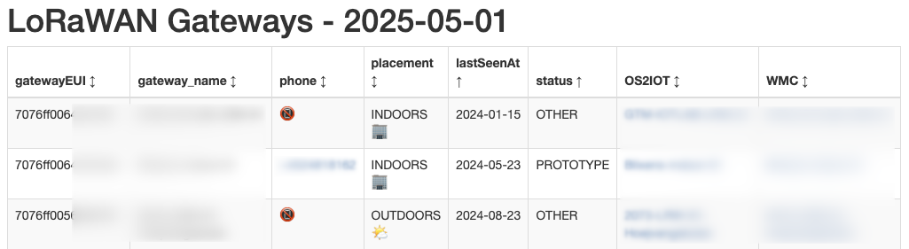

# os2iot-gatewayoverview
LoRaWAN-gateways in OS2IOT presented with relevant data and external links 

## Configuration
Copy the `.env-example-file` to `.env`
Edit the values in `.env`
Install the needed Python modules

## Usage
Run the `gateways.ipynb`. It will output a HTML file. This can be set up to run daily.

Have fun!
Best, Kristian Risager Larsen, IoT Lab, Aarhus Kommune