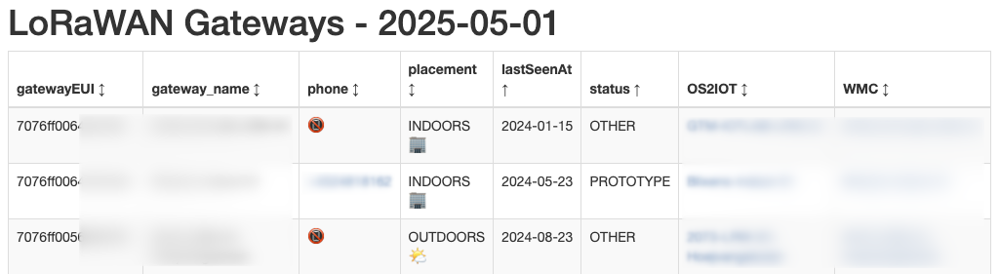

# OS2IoT Gateway overview
LoRaWAN-gateways in [OS2IoT](https://www.os2.eu/os2iot) presented with relevant data and external links 

## Configuration
Copy the `.env-example-file` to `.env`
Edit the values in `.env`

Install the needed Python modules in requirements.txt: `python3 -m pip install -r requirements.txt`

## Usage
Run the `gateways.ipynb`. It will output a HTML file. This can be set up to run daily.

## Scheduling
Configure something like this using Unix' cron or set it up in Windows' Task Scheduler: 
`14 08-16 * * * python3 /path/to/gateways.py`

Have fun!
Best, Kristian Risager Larsen, IoT Lab, Aarhus Kommune